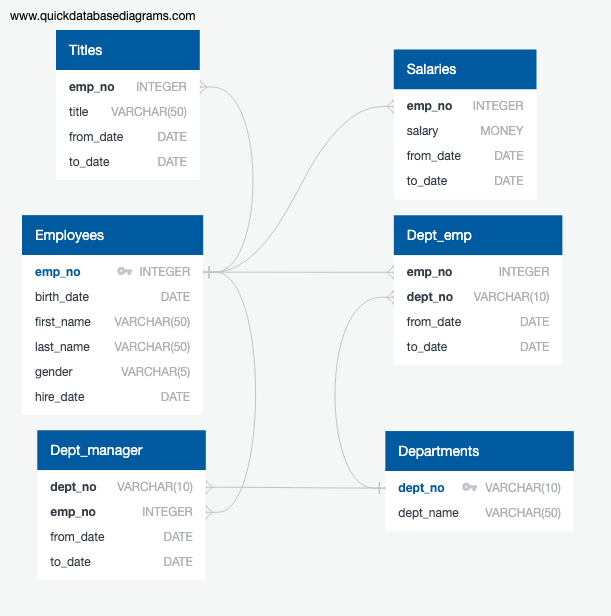
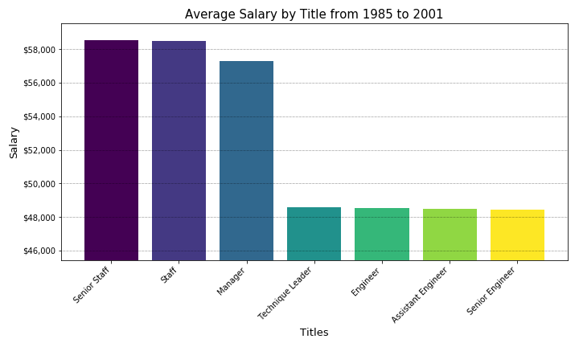
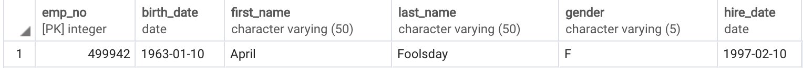

# Employee Database: A Mystery in Two Parts

#### Data Modeling

<p align="center">
  
</p>

#### Data Engineering

* Use the information you have to create a table schema for each of the six CSV files. Remember to specify data types, primary keys, foreign keys, and other constraints.

```ruby
CREATE TABLE employees (
    emp_no INTEGER PRIMARY KEY  NOT NULL,
    birth_date DATE   NOT NULL,
    first_name VARCHAR(50)   NOT NULL,
    last_name VARCHAR(50)   NOT NULL,
    gender VARCHAR(5)   NOT NULL,
    hire_date DATE   NOT NULL
);
```
```ruby
CREATE TABLE departments (
    dept_no VARCHAR(10) PRIMARY KEY   NOT NULL,
    dept_name VARCHAR(50)   NOT NULL
);
```
```ruby
CREATE TABLE dept_emp (
    emp_no INTEGER   NOT NULL,
    dept_no VARCHAR(10)   NOT NULL,
    from_date DATE   NOT NULL,
    to_date DATE   NOT NULL,
FOREIGN KEY(emp_no) REFERENCES employees (emp_no),
FOREIGN KEY(dept_no) REFERENCES departments (dept_no)	
);
```
```ruby
CREATE TABLE dept_manager (
    dept_no VARCHAR(10)   NOT NULL,
    emp_no INTEGER   NOT NULL,
    from_date DATE   NOT NULL,
    to_date DATE   NOT NULL,
FOREIGN KEY(dept_no) REFERENCES departments (dept_no),
FOREIGN KEY(emp_no) REFERENCES employees (emp_no)	
);
```
```ruby
CREATE TABLE salaries (
    emp_no INTEGER   NOT NULL,
    salary MONEY   NOT NULL,
    from_date DATE   NOT NULL,
    to_date DATE   NOT NULL,
FOREIGN KEY(emp_no) REFERENCES employees (emp_no)
);
```
```ruby
CREATE TABLE titles (
    emp_no INTEGER   NOT NULL,
    title VARCHAR(50)   NOT NULL,
    from_date DATE   NOT NULL,
    to_date DATE   NOT NULL,
FOREIGN KEY(emp_no) REFERENCES employees (emp_no)
);
```

* Import each CSV file into the corresponding SQL table.

#### Data Analysis

1. Details of each employee: employee number, last name, first name, gender, and salary.
```ruby
SELECT e.emp_no, e.last_name, e.first_name, e.gender, s.salary
FROM employees e
JOIN salaries s
ON e.emp_no = s.emp_no;
```
2. Employees who were hired in 1986.
```ruby
SELECT *
FROM employees
WHERE EXTRACT(YEAR FROM "hire_date") = 1986
```
3. Manager of each department with department number, department name, the manager's employee number, last name, first name, and start and end employment dates.
```ruby
SELECT dm.dept_no, d.dept_name, dm.emp_no, e.last_name, e.first_name, dm.from_date, dm.to_date
FROM dept_manager dm
JOIN departments d
ON dm.dept_no = d.dept_no
JOIN employees e
ON dm.emp_no = e.emp_no
ORDER BY dm.dept_no;
```
4. Department of each employee with employee number, last name, first name, and department name.
```ruby
SELECT e.emp_no, e.last_name, e.first_name, d.dept_name
FROM employees e
JOIN dept_emp de
ON e.emp_no = de.emp_no
JOIN departments d
ON de.dept_no = d.dept_no ;
```
5. All employees whose first name is "Hercules" and last names begin with "B."
```ruby
SELECT * 
FROM employees
WHERE 
	first_name = 'Hercules'
	AND last_name LIKE 'B%';
```
6. All employees in the Sales department, employee number, last name, first name, and department name.
```ruby
SELECT e.emp_no, e.last_name, e.first_name, d.dept_name
FROM employees e
JOIN dept_emp de
ON e.emp_no = de.emp_no
JOIN departments d
ON de.dept_no = d.dept_no
WHERE d.dept_name = 'Sales';
```
7. All employees in the Sales and Development departments, employee number, last name, first name, and department name.
```ruby
SELECT e.emp_no, e.last_name, e.first_name, d.dept_name
FROM employees e
JOIN dept_emp de
ON e.emp_no = de.emp_no
JOIN departments d
ON de.dept_no = d.dept_no
WHERE d.dept_name = 'Sales'
OR d.dept_name = 'Development';
```
8. In descending order, frequency count of employee last names.
```ruby
SELECT e.last_name,
COUNT(e.last_name) as count_last_names
FROM employees e
GROUP BY e.last_name
ORDER BY count_last_names DESC;
```
## Jupyter Notebook

* Average salary by title.

<p align="center">
  
</p>
The suspicion that the dataset is wrong is confirmed. The salaries are substantially the same for several functions of different hierarchical levels.
In addition, the employee number assigned is a number already used in the database.

<p align="center">
  
</p>

To be able to follow salaries by position, the company should have to define one title_id as primary key in Title table and place it as foreign key in the Salary table.
